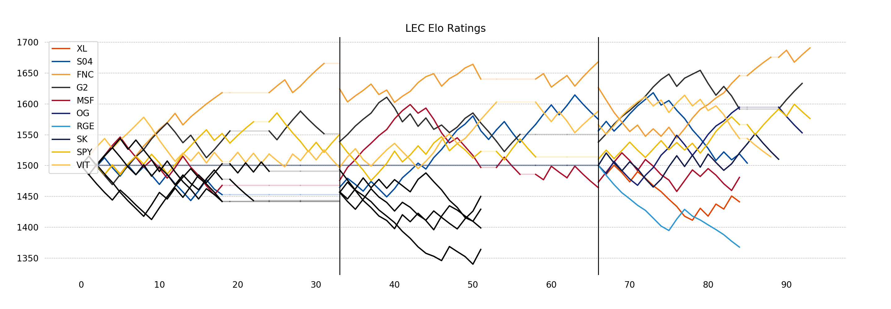
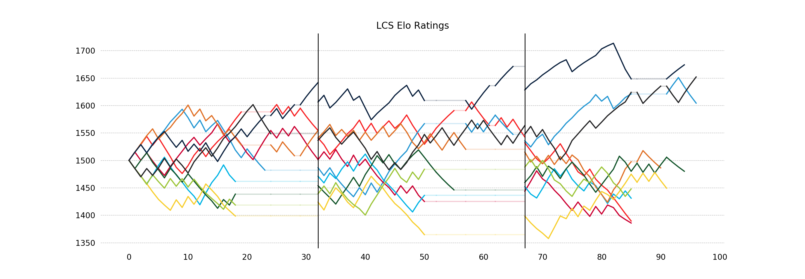

# League of Elo

Elo rating system and game predictions for Professional League of Legends Teams

## Fundamentals

Elo is a rating system developed to rate chess players, but it's a good system for rating players or teams in any zero-sum game. League of Legends is a zero sum game, so it should work for League as well.

The implementation of this model is based on [FiveThirtyEight's NFL team elo rating system model](https://fivethirtyeight.com/methodology/how-our-nfl-predictions-work/). There are two key points to note here:
1. For each match, the model generates a prediction and the teams gain/lose points based on how correct the model was. Because predicting match outcomes is integral to the model, it tunes itself over time to predict matches as optimally as possible.
2. Teams all start out at a 1500 rating. In between seasons, teams ratings regress 25% toward the mean (1500) to adjust for any roster or other changes. It also tells the model that there is more uncertainty at the beginning of each new season.

### Calibration

Brier scores were added to the model to calibrate for the optimal K parameter. This optimal value turned out to be about 30, which is a pretty high K parameter. This makes sense because we want to bias more heavily toward more recent results, and each team only gets 2 data points each week (during the regular season).

## LEC Predictions

The model is currently using data that goes back to Spring 2018. The plot below is generated by the model and shows the progression of team ratings since the beginning of Spring 2018. Some teams were discontinued at the start of franchising and some teams were added. The discontinued teams are shown in black.



```
LEC Elo Ratings
    FNC  1690
     G2  1633
    SPY  1576
     OG  1552
    VIT  1513
     SK  1509
    S04  1503
    MSF  1480
    UOL  1462
    ROC  1446
     XL  1440
    GIA  1423
    H2k  1397
    RGE  1367
```

### Predictions

Finally, the model can generate predictions for any hypothetical matchup. The next match is FNC vs OG in the leadup to the finals. The model is giving Fnatic a sizeable edge, giving them a 68% chance of taking down Origen. If Fnatic takes it, they'll favored to beat G2 in the final. If OG advances instead, G2 will be the favorite in the final.

## LCS Predictions

The model currently has data going back to the beginning of franchising for the LCS. The plot below, generated by the model, shows the progression of team ratings since the start of franchising. The table below the figure shows the ratings of the LCS teams before the Spring 2019 finals.



```
LCS Elo Ratings
     TL  1674
    TSM  1651
     C9  1604
    FOX  1486
    FLY  1480
    GGS  1449
    OPT  1447
    CLG  1431
    100  1389
     CG  1385
```

### Predictions

Finally, the model can generate predictions for any hypothetical matchup. Of course the most interesting one is the finals matchup of TL vs TSM. The model is giving TL a very slight edge, giving them a 53% chance of taking down TSM in the finals.
