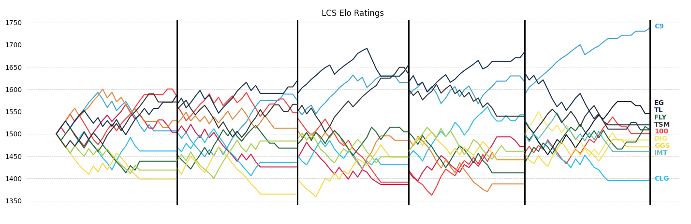
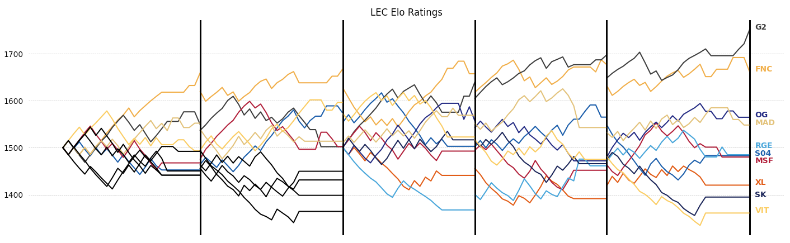
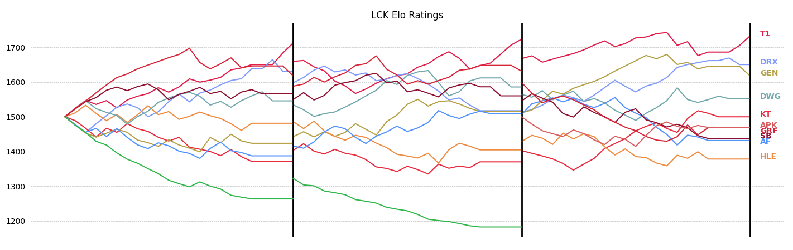
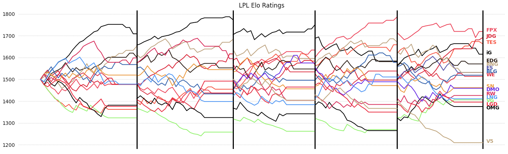

# League of Elo

Elo rating system and game predictions for Professional League of Legends Teams

## Setup
`pip3 install mwclient numpy matplotlib plotly`

## Fundamentals

Elo is a rating system developed to rate chess players, but it's a good system for rating players or teams in any zero-sum game. League of Legends is a zero sum game, so it should work for League as well.

The implementation of this model is based on [FiveThirtyEight's NFL team elo rating system model](https://fivethirtyeight.com/methodology/how-our-nfl-predictions-work/). There are two key points to note here:
1. For each match, the model generates a prediction and the teams gain/lose points based on how correct the model was. Because predicting match outcomes is integral to the model, it tunes itself over time to predict matches as optimally as possible.
2. Teams all start out at a 1500 rating. In between seasons, teams ratings regress 25% toward the mean (1500) to adjust for any roster or other changes. It also tells the model that there is more uncertainty at the beginning of each new season.

### Calibration

Brier scores were added to the model to calibrate for the optimal K parameter. This optimal value turned out to be about 30, which is a pretty high K parameter. This makes sense because we want to bias more heavily toward more recent results, and each team only gets 2 data points each week (during the regular season).

## LCS Predictions

The model currently has data going back to the beginning of franchising for the LCS. The plot below, generated by the model, shows the progression of team ratings since the start of franchising. The table below the figure shows the ratings of the LCS teams as of the end of the Spring Split 2020.



```
LCS Elo Ratings
   C9  1758
   EG  1540
   TL  1519
  FLY  1514
  TSM  1507
  100  1496
  DIG  1480
  IMT  1459
  GGS  1451
  CLG  1396
```

## LEC Predictions

The model is currently using data that goes back to Spring 2018. The plot below is generated by the model and shows the progression of team ratings since the beginning of Spring 2018. Some teams were discontinued at the start of franchising and some teams were added. Discontinued teams are shown in black. The table below the figure shows the ratings of the LCS teams as of the end of the Spring Split 2020.



```
LEC Elo Ratings
   G2  1750
  FNC  1662
   OG  1564
  MAD  1548
  RGE  1484
  S04  1483
  MSF  1480
   XL  1420
   SK  1394
  VIT  1360
```

## LCK Predictions

The model is currently using data that goes back to Spring 2019. This version of the model has a modifier for match score, which is highly relevant here since the LCK regular season uses Bo3s. The table below the figure shows the ratings of the LCK teams as of the end of the Spring Split 2020.



```
LCK Elo Ratings
   T1  1732
  DRX  1650
  GEN  1618
  DWG  1551
   KT  1499
  APK  1469
  GRF  1468
   SB  1437
   AF  1431
  HLE  1378
```

## LPL Predictions

The model is currently using data that goes back to Spring 2018. This version of the model has a modifier for match score, which is highly relevant here since the LPL regular season uses Bo3s. The table below the figure shows the ratings of the LPL teams as of the end of the Spring Split 2020.



```
LPL Elo Ratings
  FPX  1719
  JDG  1691
  TES  1663
   iG  1615
  EDG  1570
  RNG  1531
   ES  1531
  BLG  1519
   WE  1513
   SN  1461
  DMO  1458
   RW  1425
  LNG  1410
   VG  1406
  LGD  1395
  OMG  1375
   V5  1209
```
