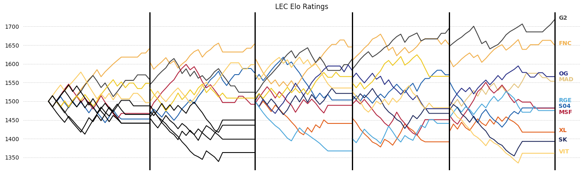

# League of Elo

Elo rating system and game predictions for Professional League of Legends Teams

## Setup
`pip3 install mwclient matplotlib`

## Fundamentals

Elo is a rating system developed to rate chess players, but it's a good system for rating players or teams in any zero-sum game. League of Legends is a zero sum game, so it should work for League as well.

The implementation of this model is based on [FiveThirtyEight's NFL team elo rating system model](https://fivethirtyeight.com/methodology/how-our-nfl-predictions-work/). There are two key points to note here:
1. For each match, the model generates a prediction and the teams gain/lose points based on how correct the model was. Because predicting match outcomes is integral to the model, it tunes itself over time to predict matches as optimally as possible.
2. Teams all start out at a 1500 rating. In between seasons, teams ratings regress 25% toward the mean (1500) to adjust for any roster or other changes. It also tells the model that there is more uncertainty at the beginning of each new season.

### Calibration

Brier scores were added to the model to calibrate for the optimal K parameter. This optimal value turned out to be about 30, which is a pretty high K parameter. This makes sense because we want to bias more heavily toward more recent results, and each team only gets 2 data points each week (during the regular season).

## LCS Predictions

The model currently has data going back to the beginning of franchising for the LCS. The plot below, generated by the model, shows the progression of team ratings since the start of franchising. The table below the figure shows the ratings of the LCS teams as of the end of the Spring Split 2020.


```
LCS Elo Ratings
   C9  1737
   EG  1545
   TL  1520
  FLY  1509
  TSM  1508
  100  1500
  DIG  1486
  GGS  1471
  IMT  1460
  CLG  1394
```

## LEC Predictions

The model is currently using data that goes back to Spring 2018. The plot below is generated by the model and shows the progression of team ratings since the beginning of Spring 2018. Some teams were discontinued at the start of franchising and some teams were added. Discontinued teams are shown in black. The table below the figure shows the ratings of the LCS teams as of the end of the Spring Split 2020.



```
LEC Elo Ratings
   G2  1718
  FNC  1649
   OG  1565
  MAD  1553
  S04  1482
  MSF  1481
  RGE  1475
   XL  1417
   SK  1392
  VIT  1361
```